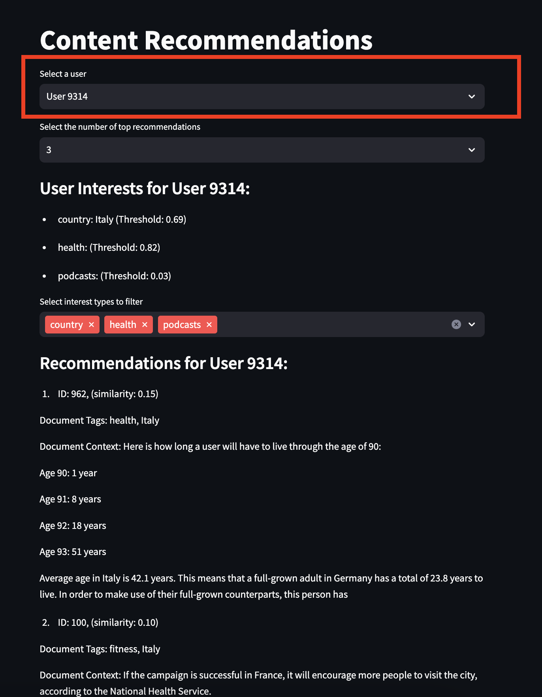

# Content Recommendation System
This project is a content recommendation system that leverages user interests to suggest relevant documents. It utilizes a pre-trained SentenceTransformer model to create embeddings for both user interests and content, enabling effective matching based on semantic similarity. The application is built using Streamlit for the user interface and ChromaDB for managing the content database.


# Table of Contents
1. [Features](#Features)
2. [Installation](#Installation)
3. [Running the Application](#RunningtheApplication)
4. [Matching Logic](#MatchingLogic)
5. [Additional Matching Logic](#AdditionalMatchingLogic)
6. [UI Structure](#UIStructure)
7. [Run testing](#Testing)
8. [Additional Development Steps](#AdditionalDevelopmentSteps)


## Features
Load user and content data from JSON files.
Generate content embeddings using a pre-trained model.
Match users to content based on their interests.
Filter recommendations based on selected interest types.
Interactive user interface built with Streamlit.

## Installation

To set up the project, ensure you have Python installed (version 3.7 or higher). Then, follow these steps:

Install required packages:
```bash
pip install -r ./requirements.txt
```
Prepare your JSON files:
You will find relevant documentation within the generate_synth_data folder
- Create a users.json file containing user data with interests.
- Create a content.json file containing content data with tags.

## Running the Application <a name="RunningtheApplication"></a>
To run the application, we need to make sure Chromadb is running. Open a terminal and run
```bash
chroma run
```

Then execute in a different window the following command in your terminal:
```bash
streamlit run streamlit_vector_db.py
```
The application will start, and you can access it in your web browser at http://localhost:8501.

## Running the Application as a Docker Container

To run the application as a Docker container, follow these steps:

1. Ensure you have Docker installed on your system.

2. Build the Docker image:
   ```bash
   docker build -t content-recommendation-system .
   ```
3. Run the Docker container:
    ```bash
    docker run -p 8501:8501 content-recommendation-system
    ```
Access the application in your web browser at http://localhost:8501.

### Docker-specific Files
'Dockerfile': Contains instructions for building the Docker image.

### Dockerfile Explanation
The Dockerfile includes the following key steps:
1. Uses Python 3.10.14 as the base image.
2. Sets the working directory to /app.
3. Copies and installs the requirements.
4. Installs necessary system dependencies.
5. Installs a specific version of SQLite (3.46.0).
6. Copies the application code into the container.
7. Modifies the main Python file to use pysqlite3 instead of sqlite3.
8. Exposes port 8501 for Streamlit.
9. Sets the command to run the Streamlit application.

## Matching Logic <a name="MatchingLogic"></a>
The matching logic involves several key steps:
- Load Data: User and content data are loaded from JSON files.
- Embedding Generation: The SentenceTransformer model generates embeddings for both user interests and content.
- User Embedding Calculation: A user embedding is created by averaging the embeddings of their interests.
- Content Matching: The user embedding is compared against content embeddings in the ChromaDB collection to find the most relevant documents.
- Filtering Recommendations: Recommendations can be filtered based on selected interest types to refine the results.

### Key Functions
- load_json(file_path): Loads data from a specified JSON file.
prepare_content(content_data): Prepares content for embedding and metadata extraction.
- get_user_embedding(interests): Generates a user embedding based on their interests.
- match_user_to_content(collection, user_id, interests, top_n): Matches a user to content based on their interests.


## Additional Matching Techniques <a name="AdditionalMatchingLogic"></a>

In addition to the vector-based matching using SentenceTransformer and ChromaDB, we also explored other matching techniques to improve the recommendation system. These techniques focus on more specific matching criteria, particularly emphasizing the importance of country-based matching along with other interests.

### Country-Based Content Matching

We implemented two additional matching functions that prioritize country-based matching while also considering other user interests:

1. `match_country_content(users, content)`
2. `match_country_and_content(users, content)`

#### match_country_content

This function matches content to users based on the following criteria:
- Matches content tags with user interests
- Prioritizes matching based on the 'country' interest type
- Also considers other interest types for matching

```python
def match_country_content(users, content):
```
### Key features:
* Checks for exact matches between content tags and user interests
* Prioritizes country matches
* Includes content if it matches either the country or any other interest type


#### match_country_and_content
This function provides a more stringent matching criterion:
Requires both a country match and a match with at least one other interest type

```python
def match_country_and_content(users, content):
```
Key features:
* Uses flag variables to track country matches and other interest matches
* Only includes content in recommendations if both country and at least one other interest match
* Provides a more focused set of recommendations


### Comparison with Vector-Based Matching
While these methods provide more specific matching based on exact tag comparisons, the vector-based approach using SentenceTransformer and ChromaDB offers the following advantages:
* Semantic understanding of interests and content, allowing for nuanced matching
* Ability to find relevant content even when tags don't exactly match interest keywords
* Scalability to handle large amounts of content efficiently
The choice between these methods depends on the specific requirements of the recommendation system, such as the need for exact matches versus semantic similarity, and the scale of the content database.

## UI Structure <a name="UIStructure"></a>
The user interface is built using Streamlit and consists of the following components:
- User Selection: A dropdown menu allows users to select from a list of available users.

- Recommendation Count: A dropdown menu to select the number of top recommendations to display.

- User Interests Display: Displays the selected user's interests with thresholds.

- Interest Type Filtering: A multiselect option to filter recommendations based on specific interest types.

- Recommendations Display: Shows the filtered recommendations, including document IDs, similarity scores, and document context.


### Example UI Flow
- The user selects their name from the dropdown.
- The user can choose how many recommendations they want to see.
- The application displays their interests.
- The user can filter recommendations based on interest types.
- The filtered recommendations are displayed, showing relevant content based on the user's interests.

## Run Testing <a name="Testing"></a>
### Using pytest:
To run the tests using pytest, follow these steps:
Ensure you have pytest and pytest-cov installed. 

** Also make sure the path of the python project is already exported in the bashrc file ** 
and then run
```bash
python3 -m pytest ./tests/*.py
```
### Using run_cov_tests.sh
Alternatively, you can use the provided run_cov_tests.sh script to run the tests with coverage:

```bash
./run_cov_tests.sh
```
After running the above script it will export an index.html file within htmlcov folder that shows the percentage of each file that the test covered.

## Additional Development Steps <a name="AdditionalDevelopmentSteps"></a>

To further improve the robustness, reliability, and efficiency of our content recommendation system, we've implemented the following additional steps:

### 1. Enhanced Synthetic Data Generation

We've improved our synthetic data generation process to create more realistic and diverse datasets for testing and development:

- Expanded the range of interest types and values
- Introduced more varied content structures and tags
- Implemented realistic user behavior patterns
- Created edge cases to test system boundaries


### 2. Comprehensive Testing and Code Coverage
We've significantly expanded our testing suite to ensure better code coverage and system reliability:
- Unit tests for all core functions
- Integration tests for the entire recommendation pipeline
- Edge case testing for unusual user profiles and content
- Performance testing for large datasets

### 3. CI/CD Pipeline Implementation
We've set up a comprehensive CI/CD pipeline to automate testing, security checks, and deployment:

#### Pipeline Stages
* Code Linting and Formatting
* Unit and Integration Testing
* Security Vulnerability Scan
* Performance Benchmarking
* Docker Image Building
* Deployment to Staging
* Production Deployment
